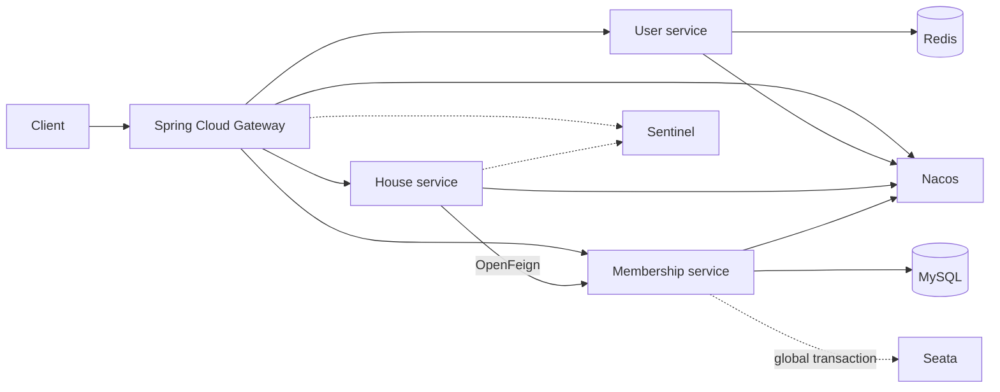

# Spring Cloud interview demo

This project is independent from the production modular monolith. It demonstrates a real cloud call path without forcing a 2 GB server to run every middleware component.

## Modules

| Module | Port | Responsibility |
| --- | ---: | --- |
| `gateway` | 9000 | Gateway routing, unified ingress and Sentinel integration |
| `user-app` | 9101 | User boundary and Redis integration point |
| `house-app` | 9102 | House detail API and OpenFeign membership check |
| `membership-app` | 9103 | Permission, one-time redemption and Seata transaction boundary |
| `contracts` | - | Stable inter-service DTO contracts |

The house service uses a fail-closed fallback: if membership is unavailable, paid house details remain protected.

## Run locally

1. `docker compose up -d mysql redis nacos sentinel`
2. `mvn clean package`
3. Start `UserApplication`, `MembershipApplication`, `HouseApplication`, then `GatewayApplication` from the IDE.
4. Run `curl -H "X-User-Id: 1" http://127.0.0.1:9000/cloud/api/houses/1001`.

Start Seata only for the transaction demonstration: `docker compose --profile seata up -d seata`. Set `SEATA_ENABLED=true` after its registry and service-group configuration is ready.

## Interview scenarios

- Stop membership service: the Sentinel/Feign fallback denies the detail request.
- Redeem one code concurrently: the conditional update permits one successful consumer.
- Disable Redis: the production app falls back to in-memory rate limiting for single-node operation.
- Explain deployment: the public 2 GB host runs the modular monolith; this full stack is a local architecture exercise.
