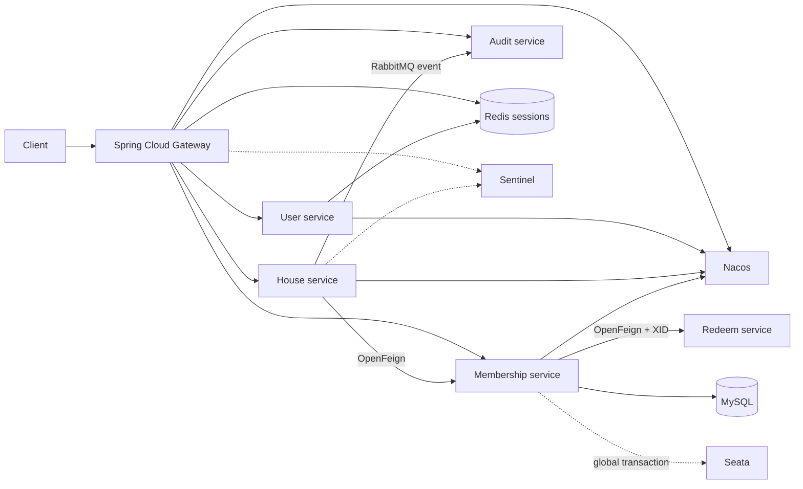

# Spring Cloud interview demo

This project is independent from the production modular monolith. It demonstrates a real cloud call path without forcing a 2 GB server to run every middleware component.

## Modules

| Module | Port | Responsibility |
| --- | ---: | --- |
| `gateway` | 9000 | Routing, Redis session authentication and Sentinel integration |
| `user-app` | 9101 | Registration, BCrypt password authentication and session issue |
| `house-app` | 9102 | House detail API and OpenFeign membership check |
| `membership-app` | 9103 | Permission, one-time redemption and Seata transaction boundary |
| `audit-app` | 9104 | RabbitMQ consumer for browsing history and audit events |
| `redeem-app` | 9105 | Independent redemption database and Seata transaction participant |
| `contracts` | - | Stable inter-service DTO contracts |



The house service uses a fail-closed fallback: if membership is unavailable, paid house details remain protected.

## Run locally

1. Set `INTERNAL_SERVICE_TOKEN` to a cryptographically random value of at least 32 characters (for example, `export INTERNAL_SERVICE_TOKEN=$(openssl rand -hex 32)`). Do not commit it. All services and Gateway require the same value.
2. `docker compose up -d mysql redis rabbitmq nacos sentinel zipkin`
2. `mvn clean package`
3. Start `UserApplication`, `MembershipApplication`, `HouseApplication`, then `GatewayApplication` from the IDE.
4. Register and receive an opaque session token:

```bash
curl -X POST http://127.0.0.1:9000/cloud/api/users/register \
  -H "Content-Type: application/json" \
  -d '{"phone":"18100000001","password":"DemoPass123"}'
```

5. Use the returned `accessToken`; the gateway resolves the user and overwrites any client-supplied identity header:

```bash
curl http://127.0.0.1:9000/cloud/api/houses/1001 \
  -H "Authorization: Bearer <accessToken>"
```

Nacos is at `http://127.0.0.1:8848/nacos`, Sentinel at `http://127.0.0.1:8858`, RabbitMQ at `http://127.0.0.1:15672`, and Zipkin at `http://127.0.0.1:9411`.

To run the four applications in containers instead of the IDE, package first and then start the `apps` profile:

```bash
mvn clean package
docker compose --profile apps up -d --build
```

For the cross-service transaction demonstration, enable Seata while starting both profiles:

```bash
SEATA_ENABLED=true docker compose --profile seata --profile apps up -d --build
```

Membership owns `zhongjiebang_cloud.cloud_memberships`; redemption owns `zhongjiebang_redeem.redeem_codes`. The global XID propagates through OpenFeign, so a membership failure rolls back the redemption branch through each database's `undo_log`.

## Interview scenarios

- Stop membership service: the Sentinel/Feign fallback denies the detail request.
- Send a fake `X-User-Id`: the gateway removes it and derives identity only from the Redis session.
- Redeem one code concurrently: the conditional update permits one successful consumer.
- Disable Redis: the production app falls back to in-memory rate limiting for single-node operation.
- Explain deployment: the public 2 GB host runs the modular monolith; this full stack is a local architecture exercise.

Performance methodology and SQL execution-plan checks are documented in [`docs/PERFORMANCE.md`](docs/PERFORMANCE.md); the k6 workload is in [`performance/house-detail.js`](performance/house-detail.js).

## Security decisions

- Passwords use BCrypt with cost 12.
- Access tokens are opaque random values; Redis stores only SHA-256 token digests.
- Sessions expire after 12 hours and identity headers are never trusted from the public client.
- Membership degradation is fail-closed so a dependency outage cannot expose paid data.
- Nacos authentication is disabled only in the local Compose environment and must not be copied to a public server.

## Review corrections (2026-09-23)

- Service HTTP endpoints require `X-Internal-Token`. Gateway overwrites external identity and internal-token headers; Feign sends the configured token. Direct service calls with only `X-User-Id` are rejected.
- Compose does not publish business-service ports. Middleware management ports and Gateway bind to loopback. RabbitMQ uses a dedicated local demo account instead of cross-container guest access. This remains a local demo, not a production mTLS design.
- Seata must be enabled for cross-database redemption. Full coordinator rollback and message broker failure recovery are not yet end-to-end verified.
- Audit events now carry eventId with a unique database key. Existing local volumes must apply `infra/migrate-audit-event-id.sql` once before updating publisher and consumer. Drain old-format queued events first. Fresh volumes use the updated initialization schema. Do not delete existing volumes to apply this migration.
- CI uploads reports and rejects skipped mandatory container tests. Do not equate build success with full-stack runtime validation.
